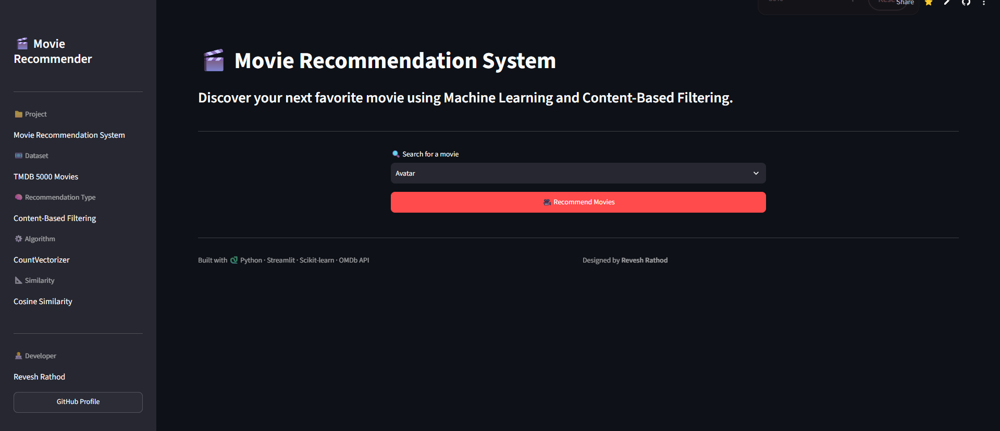
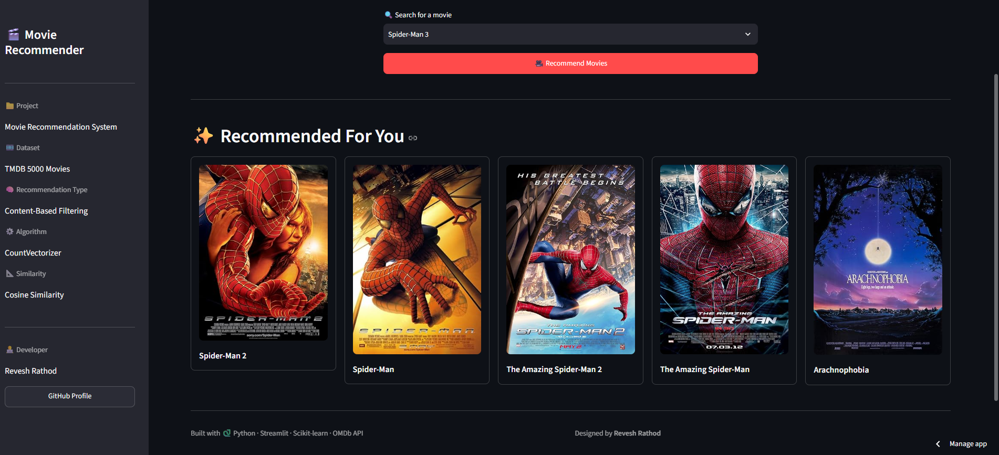

# 🎬 Movie Recommendation System

> **Discover your next favorite movie using Machine Learning and Content-Based Filtering.**

A content-based movie recommendation system built with **Python, Scikit-learn, Pandas, NumPy, and Streamlit**. The system analyzes movie metadata, converts text features into numerical representations using **CountVectorizer**, and uses **Cosine Similarity** to recommend movies similar to the title selected by the user.

The Streamlit application also integrates the **OMDb API** to fetch movie posters for recommended titles.

---

## 🌐 Live Demo

🚀 **Live Demo:** https://movie-recommendation-system-project-by-revesh-rathod.streamlit.app/

---
## 📸 Application Preview

### 🏠 Home Screen



### 🎬 Recommendations



---

## ✨ Features

- 🎯 **Content-Based Filtering** for movie recommendations
- 🧠 **Machine Learning techniques** using Scikit-learn
- 🔤 **CountVectorizer** for text feature representation
- 📐 **Cosine Similarity** for finding similar movies
- 🎨 Interactive **Streamlit** web interface
- 🖼️ **OMDb API** integration for movie posters
- ⚡ Precomputed recommendation data for faster application use

---

## 🧠 How It Works

```text
TMDB 5000 Dataset
       ↓
Data Preprocessing
       ↓
Feature Engineering
       ↓
Text Representation
       ↓
CountVectorizer
       ↓
Movie Vectors
       ↓
Cosine Similarity
       ↓
Similarity Matrix
       ↓
Streamlit Application
       ↓
User Selects a Movie
       ↓
Top Similar Movies
       ↓
OMDb API → Movie Posters
```

---

## 🔍 Recommendation Approach

This project follows a **Content-Based Filtering** approach.

Relevant movie metadata is processed and combined into a feature representation. **CountVectorizer** converts the resulting text into numerical vectors.

The system then calculates **Cosine Similarity** between the selected movie and other movies. Movies with the highest similarity scores are returned as recommendations.

### Core Concepts

**CountVectorizer**  
Converts movie text features into numerical vectors.

**Cosine Similarity**  
Measures the similarity between movie vectors to identify closely related titles.

---

## 🛠️ Tech Stack

| Category | Technologies |
|---|---|
| Language | Python |
| Data Processing | Pandas, NumPy |
| Machine Learning | Scikit-learn |
| Vectorization | CountVectorizer |
| Similarity | Cosine Similarity |
| Frontend | Streamlit |
| API | OMDb API |
| Dataset | TMDB 5000 Movies Dataset |
| Development | Jupyter Notebook, VS Code |
| Version Control | Git, GitHub |
| Large File Storage | Git LFS |

---

## 📂 Project Structure

```text
Movie-Recommendation-System/
│
├── .streamlit/
│   └── secrets.toml              # Local API secrets (not committed)
│
├── .ipynb_checkpoints/           # Local Jupyter files
├── .virtual_documents/           # Local generated files
├── myenv/                        # Python virtual environment
│
├── app.py                        # Streamlit application
├── movie_list.pkl                # Processed movie data
├── similarity.pkl                # Similarity matrix (Git LFS)
├── movie_recommender_system.ipynb# Recommendation development notebook
│
├── tmdb_5000_movies.csv          # Movie dataset
├── tmdb_5000_credits.csv         # Credits dataset
├── requirements.txt              # Python dependencies
├── .gitignore                    # Ignored files and secrets
├── .gitattributes                # Git LFS configuration
└── README.md                     # Project documentation
```

> **Note:** `.streamlit/secrets.toml`, `myenv/`, `.ipynb_checkpoints/`, and `.virtual_documents/` are local development resources and should not be uploaded.

---

## 🚀 Run Locally

### 1. Clone the repository

```bash
git clone https://github.com/reveshrathod005/Movie-Recommendation-System.git
```

### 2. Navigate to the project

```bash
cd Movie-Recommendation-System
```

### 3. Create a virtual environment

```bash
python -m venv myenv
```

Activate it on Windows:

```bash
myenv\Scripts\activate
```

### 4. Install dependencies

```bash
pip install -r requirements.txt
```

### 5. Configure the OMDb API key

Create:

```text
.streamlit/secrets.toml
```

Add:

```toml
OMDB_API_KEY = "YOUR_OMDB_API_KEY"
```

Keep this file local and never commit it to GitHub.

### 6. Run the application

```bash
streamlit run app.py
```


## 🔄 Project Workflow

1. Load the TMDB 5000 movie and credits datasets.
2. Clean and preprocess the movie metadata.
3. Combine relevant movie features.
4. Apply **CountVectorizer** to convert text into vectors.
5. Calculate **Cosine Similarity** between movie vectors.
6. Store the processed movie data and similarity matrix.
7. Load the generated data into the Streamlit application.
8. Let the user select a movie.
9. Retrieve the most similar movies.
10. Fetch movie posters through the **OMDb API**.
11. Display the recommendations in the Streamlit interface.

---

## 🔐 API Security

The OMDb API key is stored using **Streamlit Secrets** instead of being hard-coded in the application.

Local configuration:

```text
.streamlit/secrets.toml
```

Example:

```toml
OMDB_API_KEY = "YOUR_OMDB_API_KEY"
```

The secrets file is excluded through `.gitignore`.

---

## 📦 Large File Handling

The `similarity.pkl` file is larger than GitHub's standard file-size limit, so it is managed using **Git Large File Storage (Git LFS)**.

This allows the required similarity data to be stored separately from normal Git objects while keeping the repository manageable.

---

## 🎯 What I Learned

- Building a recommendation system using real-world movie data
- Data preprocessing and feature engineering
- Text vectorization with CountVectorizer
- Similarity-based recommendation using Cosine Similarity
- Working with Pandas, NumPy, and Scikit-learn
- Building interactive applications with Streamlit
- Integrating an external API
- Managing large files with Git LFS
- Using Git and GitHub for version control
- Preparing a machine learning project for deployment

---

## 🚀 Future Improvements

- ⭐ User-rating based recommendations
- 🎭 Genre-based filtering
- 🔥 Trending and popular movie sections
- 🎥 Trailer integration
- ❤️ Favorites / watchlist
- 🔎 Richer movie information
- ☁️ Further cloud deployment improvements

---

## 👨‍💻 Author

### Revesh Rathod

B.Tech Student | Python | Machine Learning | Data & AI

**GitHub:**  
https://github.com/reveshrathod005

---

## ⭐ Support

If you found this project interesting, consider giving the repository a ⭐ on GitHub.
